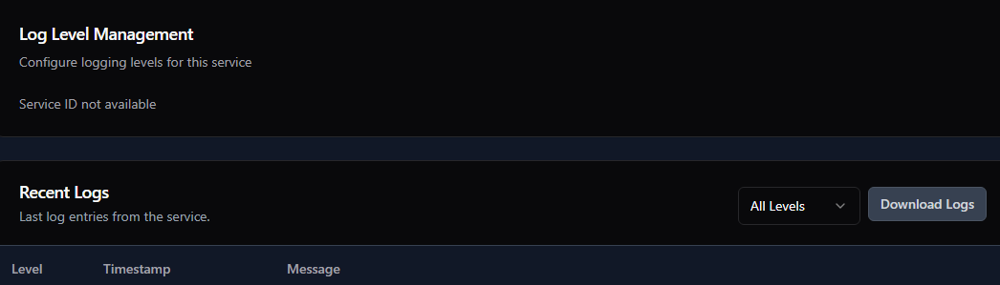
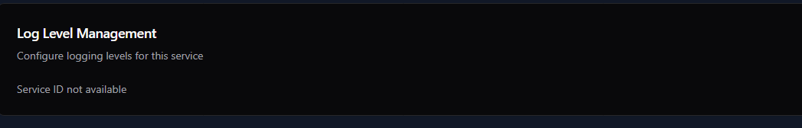
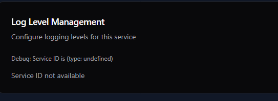
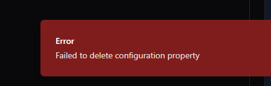
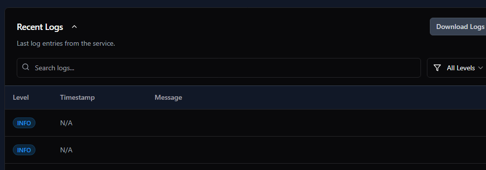
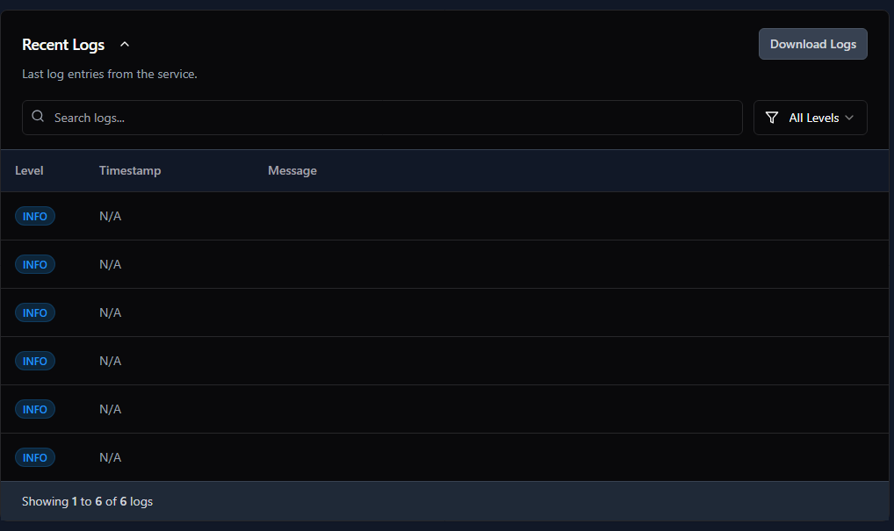

# Spring Boot Monitoring Dashboard

A comprehensive Spring Boot monitoring platform designed to simplify application management and provide actionable insights for development and operations teams.

## Architecture

The system consists of two main components:

1. **Monitoring Dashboard** (Node.js/React)
   - Central server with registration endpoints
   - Real-time monitoring and visualization
   - WebSocket-based log streaming
   - Configuration management interface
   - Light and dark theme support

2. **Spring Boot Client** (Java)
   - Auto-configuration JAR for Spring Boot applications
   - Automatic service registration
   - Metrics collection integration
   - Zero configuration setup (with sensible defaults)
   - Support for Spring Boot 2.7.x through 3.2.x

## Features

- **Service Health Monitoring**: Real-time health status of all Spring Boot applications
- **Metrics Dashboard**: Memory, CPU, and error metrics with historical trends
- **Log Streaming**: Real-time log streaming from applications to the dashboard
- **Configuration Management**: View and update application properties
- **Self-Registration**: Applications automatically register with the dashboard
- **Responsive Design**: Works on desktop, tablet, and mobile devices
- **Theme Support**: Light and dark theme options

## Getting Started

### Dashboard Setup

1. Clone this repository
2. Install dependencies:
   ```
   npm install
   ```
3. Start the dashboard:
   ```
   npm run dev
   ```
4. Access the dashboard at http://localhost:5000

### Spring Boot Application Integration

1. Add the client dependency to your Spring Boot application:
   ```xml
   <dependency>
     <groupId>com.example</groupId>
     <artifactId>boot-monitoring-client</artifactId>
     <version>1.0.0</version>
   </dependency>
   ```

2. Add configuration to your `application.properties`:
   ```properties
   # Enable monitoring
   monitor.enabled=true
   
   # Dashboard URL
   monitor.dashboard-url=http://localhost:5000
   
   # Application ID (optional, will be generated if not provided)
   monitor.app-id=my-application-id
   ```

3. Ensure Spring Boot Actuator is properly configured:
   ```properties
   # Expose all actuator endpoints
   management.endpoints.web.exposure.include=*
   
   # Show detailed health information
   management.endpoint.health.show-details=always
   ```

4. Start your Spring Boot application

## Docker Deployment

Build and run the dashboard using Docker:

```bash
# Build the image
docker build -t spring-boot-monitor .

# Run the container
docker run -p 3000:3000 spring-boot-monitor
```

For Kubernetes deployment, use the provided Kubernetes manifests in the `k8s` directory.

## Architecture Diagram

```
┌────────────────────┐     Register     ┌───────────────────┐
│  Spring Boot App   │───────────────▶ │                   │
│                    │                  │     Dashboard     │
│  ┌──────────────┐  │ ◀───────────────│                   │
│  │   Actuator   │  │   Health Check   │  ┌─────────────┐  │
│  └──────────────┘  │                  │  │  WebSocket  │  │
│                    │   Metrics/Logs   │  │   Server    │  │
│  ┌──────────────┐  │───────────────▶ │  └─────────────┘  │
│  │ Registration │  │                  │                   │
│  │    Client    │  │                  │  ┌─────────────┐  │
│  └──────────────┘  │                  │  │ React UI    │  │
└────────────────────┘                  │  └─────────────┘  │
                                         └───────────────────┘
```

## Dashboard Screenshots

### Services Overview


### Service Detail View


### Log Streaming


### Metrics Dashboard


### Configuration Management


### Dark Theme Support


## Development

### Project Structure

- `/client` - React frontend application
- `/server` - Node.js backend services
- `/shared` - Shared schemas and types
- `/examples` - Example Spring Boot integration code

### Building the Spring Boot Client

Navigate to the `/examples` directory and build the client:

```bash
cd examples
mvn clean package
```

## Contributing

Contributions are welcome! Please feel free to submit a Pull Request.

## License

This project is licensed under the MIT License - see the LICENSE file for details.